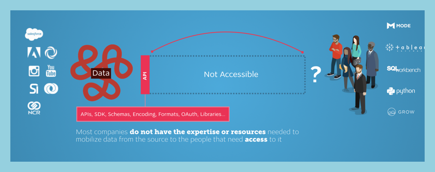
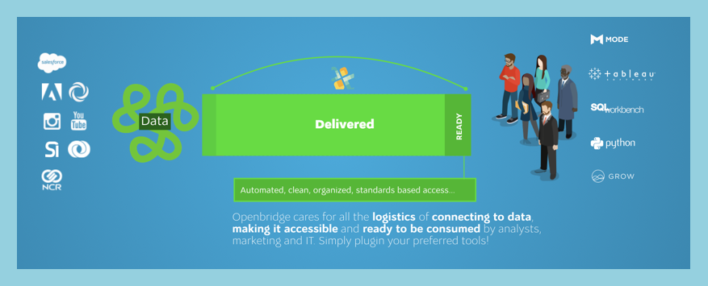
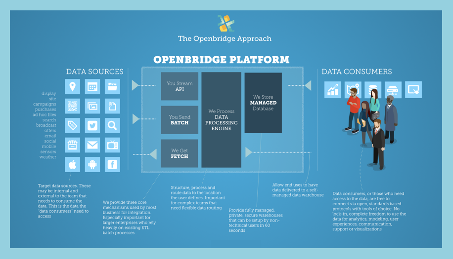

# Welcome To Openbridge

## Overview

This documentation is intended to get you the basics of running Openbridge applications. We’ll cover everything you need to know, from authentication, to data delivery, to systems setup. All code examples will be stored and documented in our public repositories.
Feel free to fork, clone, and improve the sample code and guides.

## Openbridge Platform

### Challenges

### Openbridge Architecture

The diagram describes the conceptual architecture of Openbridge, which acts as a bridge between data sources and those who need/want to consume the data

### Openbridge Technology 101
The Openbridge Data Pipeline include three specific resources for delivery of data into our system

 - ** Data Bridges**: Data Bridges are considered “outbound” or "inbound" data services. They are connections that facilitate the flow of data between systems.
  - ** Outbound Bridge **: This involves "pulling" or "fetching” from a third party data source locally to Openbridge.
- ** Inbound Bridge **: This involves a third party "pushing" or "sending” data from to Openbridge.
 - ** Data Pipelines**: Data Bridges are considered “outbound” data services. They are adapters that are built for “fetching”  (connecting, processing and storing data) from a third party data source.
  - ** Routing **: Processing Service is a distributed real-time computation system for processing fast, large (and small) streams of data
  - ** Processing **: Processing Service is a distributed real-time of data as it flows through the system. Data is modeled, joined and aggregated  into usable data sets. This produces a collection of organized and accessible tables for simple consumption the data with preferred tools.
 - ** Data Warehouse **: Warehouse Services is a fast, fully-managed, petabyte-scale data warehouse service.

# Guides
The following is a limited collection of guides to help provide context on how to use the Openbridge system.

## Data Pipelines

## Data Bridges

- ** [Adobe Analytics](http://www.adobe.com/solutions/digital-analytics.html) ** : Adobe Analytics provides one of the leading web analytics solutions on the market. We have detailed two methods of extracting data from Adobe to Openbridge.

 - ** Adobe Clickstream Feeds (ACF) **: We provided hints, considerations, samples and steps to follow for accepting Adobe Clickstream feeds.

 - ** Adobe Datawarehouse Feeds (ADF) **: Documentation of setting up ADF to Openbridge.

</ul>

- ** [Kenshoo](http://kenshoo.com) **: Kenshoo provides the ability to push feeds directly to Openbridge. Please contact your Kenshoo account rep to request feeds be configured.

 - ** Kensoo Feeds **: Notes on delivery of paid social data from Kenshoo to Openbridge.

# Expert Services
We also offer expert service for development, consulting or subject matter expertise.

# Issues

If you have any problems with or questions about this image, please contact us through a GitHub issue.

# Contributing

You are invited to contribute new features, fixes, or updates, large or small; we are always thrilled to receive pull requests, and do our best to process them as fast as we can.

Before you start to code, we recommend discussing your plans through a GitHub issue, especially for more ambitious contributions. This gives other contributors a chance to point you in the right direction, give you feedback on your design, and help you find out if someone else is working on the same thing.

## Questions or need help?

Check out the **[Talk to us] [talk-to-us]** page on our wiki.
